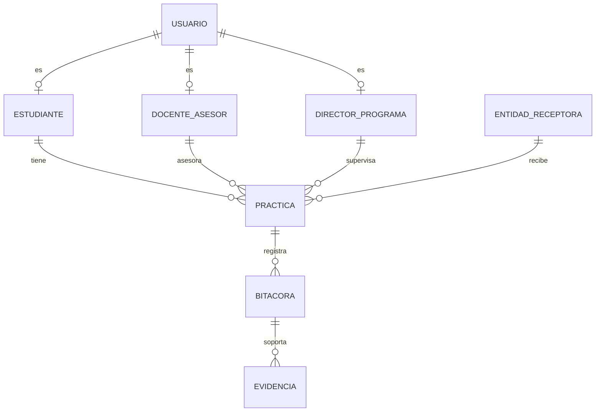

# Segunda Entrega - Proyecto Integrador

**Universidad de Investigación y Desarrollo (UDI)**  
**Programa:** Licenciatura (Proyecto Integrador)  
**Fecha:** 31/03/2026  
**Equipo:** Rafael Fabian Carreño Barrera, Yeison Nicolas Marino Roberto, Santiago Andres Rojas  

---

## Tabla de contenido

1. Introducción  
1.1 Propósito  
1.2 Alcance  
1.3 Definiciones, acrónimos y abreviaturas  
1.4 Referencias  
1.5 Apreciación global  
2. Descripción del problema  
2.1 Perspectiva del producto  
2.2 Funciones del producto  
2.3 Características de los usuarios  
2.4 Restricciones  
2.5 Suposiciones y dependencias  
3. Objetivos  
3.1 Objetivo general  
3.2 Objetivos específicos  
4. Justificación  
5. Plan del proyecto  
6. Análisis de requerimientos del software  
6.1 Requisitos funcionales  
6.2 Requisitos no funcionales  
6.3 Reglas de negocio  
7. Diseño UML  
7.1 Diagrama de casos de uso  
7.2 Diagrama de dominio  
7.3 Diagramas de secuencia  
8. Base de datos  
8.1 Modelo entidad-relación  
8.2 Modelo relacional  
8.3 Diccionario de datos  
9. Diseño de interfaz  
9.1 Pantallas principales y comportamiento  
9.2 Criterios de diseño  
10. Referencias bibliográficas  
11. Anexos  
12. Ajustes realizados frente a observaciones docentes  
13. Ajuste de reducción del alcance  

---

# 1. Introducción

Las prácticas académicas constituyen un componente esencial del proceso formativo, ya que permiten aplicar conocimientos en contextos reales de trabajo y fortalecer el vínculo entre la formación universitaria y el entorno profesional. Sin embargo, en muchos casos su gestión continúa realizándose mediante archivos dispersos, hojas de cálculo, correos electrónicos y registros manuales, lo que dificulta el seguimiento oportuno, incrementa la carga operativa de los responsables académicos y reduce la trazabilidad del proceso.

En respuesta a esta necesidad, el presente proyecto propone el diseño e implementación de un prototipo funcional para la gestión de prácticas académicas, orientado a centralizar el registro de prácticas, el control de horas mediante bitácora, la carga de evidencias, la validación por parte del docente asesor y la consulta de reportes por parte del director del programa.

Este documento corresponde a la segunda entrega del proyecto integrador y consolida los principales productos del proceso de análisis, diseño y construcción del sistema, incluyendo requerimientos, diagramas UML, estructura de base de datos, diseño de interfaz y evidencias del prototipo.

---

## 1.1 Propósito

Definir, diseñar, implementar y validar un prototipo funcional de escritorio para la gestión de prácticas académicas, que permita controlar el registro, seguimiento y validación de horas de práctica de los estudiantes mediante una solución desarrollada en Java Swing con persistencia en Oracle.

---

## 1.2 Alcance

El alcance de esta segunda entrega incluye:

- Autenticación de usuarios por rol.
- Registro de prácticas académicas.
- Registro y seguimiento de bitácora.
- Carga de evidencias por entrada de bitácora.
- Validación o rechazo de bitácora por parte del docente asesor.
- Cierre o reapertura de práctica según cumplimiento de horas.
- Consulta de estado, historial y avance de horas.
- Generación de reportes por filtros.
- Evidencia de pruebas funcionales del prototipo.

Quedan fuera del alcance de esta entrega:

- Despliegue en ambiente de producción institucional.
- Integraciones con sistemas externos de la institución.
- Aplicación móvil nativa.
- Evaluación por rúbrica o módulos avanzados de calificación académica.
- Configuración avanzada de plantillas de bitácora.
- Registro de hallazgos institucionales.

---

## 1.3 Definiciones, acrónimos y abreviaturas

**Práctica académica:** proceso formativo en el que el estudiante desarrolla actividades en una entidad receptora.  
**Entidad receptora:** organización o institución en la que el estudiante realiza la práctica.  
**Bitácora:** registro periódico de actividades, horas y descripción del trabajo realizado durante la práctica.  
**Evidencia:** archivo o soporte asociado a una entrada de bitácora.  
**Docente asesor:** actor académico encargado de validar o rechazar los registros de bitácora del estudiante.  
**Director:** responsable del seguimiento general del proceso, asignación de responsables y consulta de reportes.  
**UML:** Unified Modeling Language.  
**ER:** Entidad-Relación.  
**RF:** Requisito funcional.  
**RNF:** Requisito no funcional.

---

## 1.4 Referencias

- SWEBOK V3.0  
- ISO/IEC 25010  
- UML 2.5.1  
- Sommerville, *Software Engineering*  
- Pressman & Maxim, *Software Engineering: A Practitioner’s Approach*  
- Reglamento institucional de prácticas académicas

---

## 1.5 Apreciación global

El documento consolida de manera estructurada los artefactos técnicos y académicos desarrollados en la segunda entrega. Se presentan el problema, los objetivos, los requerimientos, los modelos UML, la estructura de base de datos, el diseño de interfaz y los anexos de soporte, buscando responder a las observaciones realizadas en la primera entrega y mejorar la coherencia entre análisis, diseño y prototipo.

---

# 2. Descripción del problema

La gestión actual de prácticas académicas presenta dificultades importantes asociadas a la dispersión de la información y a la ausencia de un sistema centralizado. La utilización de archivos sueltos, correos y registros manuales genera demoras en el seguimiento, dificultades para consolidar información, falta de visibilidad del avance real de cada estudiante y mayor probabilidad de errores administrativos.

Entre los principales problemas identificados se encuentran:

- Fragmentación de la información del proceso de práctica.
- Falta de trazabilidad en el registro y validación de horas.
- Dificultad para consultar el estado real de cada práctica.
- Sobrecarga operativa para docente asesor y director.
- Baja capacidad para generar reportes consolidados y oportunos.

Estas dificultades afectan directamente a los tres actores principales del sistema:

- **Estudiante:** no cuenta con una vista única del estado de su práctica, de sus horas registradas y de las validaciones realizadas.
- **Docente asesor:** invierte tiempo en revisar registros manuales o dispersos y no dispone de un flujo uniforme de validación.
- **Director:** no tiene una visión consolidada del avance de las prácticas ni herramientas suficientes para controlar asignaciones, cierres y reportes.

Ante este contexto, se requiere una plataforma que centralice el proceso y permita mejorar el control, la trazabilidad y la eficiencia operativa del seguimiento de prácticas académicas.

---

## 2.1 Perspectiva del producto

El producto corresponde a un sistema de escritorio desarrollado en Java Swing con persistencia en Oracle, orientado a apoyar el proceso académico y administrativo de las prácticas. El acceso se controla por rol y cada usuario visualiza únicamente los módulos acordes con sus responsabilidades dentro del sistema.

---

## 2.2 Funciones del producto

Las principales funciones del sistema son:

- Autenticación y control de acceso por rol.
- Registro de prácticas académicas.
- Registro de bitácora y control de horas.
- Carga de evidencias por parte del estudiante.
- Validación o rechazo de bitácora por parte del docente asesor.
- Consulta de estado e historial de la práctica.
- Cierre o reapertura de práctica según cumplimiento de horas.
- Generación de reportes institucionales filtrables.

---

## 2.3 Características de los usuarios

**Estudiante:** registra su práctica, diligencia la bitácora, adjunta evidencias y consulta el avance de horas y el estado de validación.  

**Docente asesor:** revisa las entradas de bitácora del estudiante, valida o rechaza registros y deja observaciones cuando corresponde.  

**Director:** administra docentes asesores, supervisa prácticas, consulta reportes, verifica cierres y realiza seguimiento global al proceso.

---

## 2.4 Restricciones

- El sistema utiliza Oracle como motor de base de datos.
- El acceso a funcionalidades está restringido por rol.
- El prototipo se ejecuta en ambiente académico o de laboratorio.
- La disponibilidad del sistema depende de la correcta ejecución del entorno local y de la base de datos.
- El sistema no contempla integraciones externas en esta etapa.

---

## 2.5 Suposiciones y dependencias

- La institución dispone de infraestructura mínima para ejecutar el prototipo.
- Existen lineamientos académicos definidos para la gestión de prácticas.
- Los usuarios suministran datos reales o datos de prueba válidos.
- Se cuenta con acceso al motor de base de datos Oracle durante las pruebas del sistema.

---

# 3. Objetivos

## 3.1 Objetivo general

Diseñar, implementar y validar un prototipo funcional de escritorio para la gestión de prácticas académicas, que permita centralizar el registro, seguimiento, validación y control de horas de los estudiantes, mediante módulos de autenticación por rol, gestión de prácticas, bitácora, evidencias y reportes, con persistencia en Oracle y pruebas funcionales documentadas, con el fin de mejorar la trazabilidad del proceso y reducir la carga operativa de los actores académicos.

## 3.2 Objetivos específicos

1. Levantar, analizar y documentar los requerimientos funcionales, no funcionales y reglas de negocio del sistema, para definir con claridad el alcance del prototipo y las necesidades de estudiante, docente asesor y director.

2. Modelar el diseño técnico del sistema mediante diagramas UML, modelo de dominio y estructura de base de datos, para garantizar coherencia entre los procesos académicos, los casos de uso y la solución implementada.

3. Desarrollar un prototipo funcional en Java Swing con conexión a Oracle, que implemente los módulos principales del sistema: autenticación por rol, registro de prácticas, gestión de bitácora y horas, carga de evidencias, validación docente y generación de reportes.

4. Verificar el funcionamiento del prototipo mediante pruebas funcionales y validaciones de flujo, para comprobar el cumplimiento de los requerimientos definidos y evidenciar el correcto comportamiento de los módulos implementados.

5. Consolidar la documentación técnica y académica del proyecto, integrando anexos, diagramas, evidencias de prueba y artefactos de base de datos, para sustentar formalmente la solución desarrollada en la segunda entrega.

---

# 4. Justificación

La centralización de la gestión de prácticas académicas en una sola plataforma mejora la trazabilidad del proceso, reduce errores derivados del registro manual y facilita el seguimiento por parte del docente asesor y del director. La propuesta responde directamente al problema identificado, ya que integra en un mismo flujo el registro de práctica, el control de horas mediante bitácora, la validación docente y la consulta de reportes.

Desde el punto de vista académico, el proyecto también permite articular conocimientos adquiridos en asignaturas como análisis de sistemas, bases de datos, programación, pruebas y modelado UML, transformándolos en una solución concreta, verificable y coherente con el contexto institucional.

---

# 5. Plan del proyecto

| Fase | Actividades principales | Entregables |
|------|-------------------------|-------------|
| 1. Análisis | Levantamiento de necesidades, definición de alcance, identificación de actores, requerimientos y reglas de negocio. | Documento de requerimientos |
| 2. Diseño | Elaboración de diagramas UML, diseño de base de datos, modelo de dominio y prototipos de interfaz. | Diagramas UML, modelo ER, diseño de pantallas |
| 3. Construcción | Desarrollo del prototipo en Java Swing, integración con Oracle y organización modular del sistema. | Prototipo funcional |
| 4. Pruebas | Ejecución de pruebas funcionales, validación de flujos, corrección de errores y ajustes del sistema. | Evidencias de prueba |
| 5. Cierre académico | Consolidación del documento final, anexos, capturas, diagramas y evidencias. | Documento de segunda entrega |

---

# 6. Análisis de requerimientos del software

## 6.1 Requisitos funcionales

- **RF01.** Autenticar usuario por correo, contraseña y rol.  
- **RF02.** Registrar estudiante mediante autoregistro público.  
- **RF03.** Registrar y mantener docentes asesores por el director.  
- **RF04.** Gestionar entidades receptoras.  
- **RF05.** Registrar práctica académica.  
- **RF06.** Asignar docente asesor y entidad receptora a la práctica.  
- **RF07.** Registrar entradas de bitácora con fecha, actividad, descripción y horas.  
- **RF08.** Cargar evidencias asociadas a una entrada de bitácora.  
- **RF09.** Validar o rechazar entradas de bitácora con observación obligatoria en caso de rechazo.  
- **RF10.** Consultar estado, historial y avance de horas de la práctica.  
- **RF11.** Cerrar o reabrir práctica según cumplimiento de horas y estado.  
- **RF12.** Generar reportes por período, programa y estado.

## 6.2 Requisitos no funcionales

- **RNF01 Usabilidad:** el usuario debe completar las operaciones frecuentes del rol en máximo 3 clics desde el dashboard principal.  
- **RNF02 Seguridad:** el sistema debe impedir acceso a pantallas y operaciones no autorizadas según rol autenticado.  
- **RNF03 Rendimiento:** las consultas frecuentes de dashboard y reportes deben responder en menos de 3 segundos en entorno de laboratorio.  
- **RNF04 Integridad:** Oracle debe aplicar PK, FK, CHECK y UNIQUE en tablas críticas.  
- **RNF05 Trazabilidad:** cada validación o rechazo debe almacenar fecha, usuario responsable, observación y estado resultante.  
- **RNF06 Mantenibilidad:** el prototipo debe conservar estructura modular por capas.  
- **RNF07 Disponibilidad:** el sistema debe poder ejecutarse sin fallos críticos durante una sesión continua de pruebas académicas.

## 6.3 Reglas de negocio

- Una bitácora rechazada debe incluir observación del docente asesor.
- Las horas registradas por bitácora deben ser mayores que 0.
- La fecha de finalización de la práctica no puede ser menor que la fecha de inicio.
- Una práctica puede cerrarse únicamente si cumple las horas validadas requeridas.
- Las horas validadas de una práctica se calculan únicamente con base en las bitácoras validadas.

---

# 7. Diseño UML

## 7.1 Diagrama de casos de uso

El sistema se modela mediante diagramas de casos de uso organizados por actores principales:

- Estudiante
- Docente asesor
- Director

Los casos de uso centrales del sistema son:

- Registrarse como estudiante
- Registrar práctica académica
- Registrar bitácora y horas
- Vincular evidencias
- Consultar estado e historial
- Validar bitácora y horas
- Registrar observación
- Gestionar prácticas
- Gestionar docentes asesores
- Gestionar entidades receptoras
- Cerrar o reabrir práctica
- Generar reportes

El diagrama representa la interacción de estudiante, docente asesor y director con los módulos principales del sistema.

## 7.2 Diagrama de dominio

El diagrama de dominio del sistema se compone de las siguientes entidades principales:

- Usuario
- Estudiante
- DocenteAsesor
- DirectorPrograma
- EntidadReceptora
- Practica
- Bitacora
- Evidencia

Relaciones principales del dominio:

- Un usuario puede corresponder a un estudiante, un docente asesor o un director.
- Un estudiante puede tener una o varias prácticas.
- Una práctica pertenece a una entidad receptora y está asociada a un docente asesor y a un director.
- Una práctica contiene múltiples registros de bitácora.
- Una bitácora puede tener múltiples evidencias.

El diagrama muestra las entidades principales del sistema y sus relaciones.

## 7.3 Diagramas de secuencia

Para representar el comportamiento dinámico del sistema se elaboran tres diagramas de secuencia principales:

1. Gestión integral de práctica y control de horas por el director.

Este diagrama representa el flujo integral del proceso de práctica académica, desde el registro inicial de la práctica por parte del estudiante, el diligenciamiento de la bitácora, la validación por el docente asesor y la verificación final del cumplimiento de horas para el cierre del proceso.

   

2. Validación de bitácora y horas por el docente asesor.

Este diagrama muestra las funcionalidades del docente asesor, enfocadas en la revisión de prácticas asignadas, la validación o rechazo de bitácoras, el registro de observaciones y el seguimiento del avance de horas del estudiante.

3. Carga de evidencias por parte del estudiante.

Este diagrama representa el flujo mediante el cual el estudiante selecciona una práctica, consulta sus entradas de bitácora y adjunta evidencias a una entrada específica, validando previamente que la bitácora permita la carga de soportes.

---

# 8. Base de datos

## 8.1 Modelo entidad-relación

## 8.2 Modelo relacional

Las tablas principales del sistema son:

- USUARIO  
- ESTUDIANTE  
- DOCENTE_ASESOR  
- DIRECTOR_PROGRAMA  
- ENTIDAD_RECEPTORA  
- PRACTICA  
- BITACORA  
- EVIDENCIA  

## 8.3 Diccionario de datos

## 8.4 Diccionario de tablas numerado (001-008)

| Numero | Nombre tabla | Descripcion |
|---|---|---|
| 001 | `usuario` | Almacena credenciales y datos base de identidad de todos los roles del sistema (estudiante, docente y director), incluyendo estado y fecha de creacion. |
| 002 | `estudiante` | Extension del usuario para rol estudiante; guarda codigo, programa y semestre, enlazado 1 a 1 con `usuario`. |
| 003 | `docente_asesor` | Extension del usuario para rol docente; registra especialidad del docente asesor y su enlace 1 a 1 con `usuario`. |
| 004 | `director_programa` | Extension del usuario para rol director; registra el programa academico bajo su direccion y su enlace 1 a 1 con `usuario`. |
| 005 | `entidad_receptora` | Catalogo de entidades donde se realizan practicas; incluye datos de contacto, ubicacion, cupos y estado operativo. |
| 006 | `practica` | Registro principal de cada proceso de practica academica; relaciona estudiante, docente y entidad, con fechas, estado y control de horas. |
| 007 | `bitacora` | Registro de actividades y horas reportadas por practica; soporta flujo de validacion docente con estado, observacion y trazabilidad de fechas. |
| 008 | `evidencia` | Soportes asociados a cada entrada de bitacora (archivo/ruta/comentario), usados para sustentar actividades y validaciones. |

### Tabla: USUARIO

| Atributo    | Valor                                                                 |
|------------|----------------------------------------------------------------------|
| Código     | TB-001                                                               |
| Nombre     | USUARIO                                                              |
| Descripción| Almacena credenciales y datos base de identidad de todos los roles   |

| Campo       | Tipo de dato | Tamaño | Descripción                                      | Restricción                  |
|------------|--------------|--------|--------------------------------------------------|------------------------------|
| id_usuario | NUMBER       | —      | Identificador único del usuario                  | PK                           |
| nombre     | VARCHAR2     | 50     | Nombre del usuario                               | NOT NULL                     |
| apellido   | VARCHAR2     | 50     | Apellido del usuario                             | NOT NULL                     |
| correo     | VARCHAR2     | 100    | Correo institucional                             | NOT NULL, UNIQUE             |
| contrasena | VARCHAR2     | 100    | Contraseña del usuario                           | NOT NULL                     |
| rol        | VARCHAR2     | 20     | ESTUDIANTE, DOCENTE, DIRECTOR                    | NOT NULL, CHECK              |
| estado     | VARCHAR2     | 20     | ACTIVO, INACTIVO                                 | NOT NULL, CHECK              |

### Tabla: ESTUDIANTE

| Campo | Tipo de dato | Tamaño | Descripción | Restricción |
|------|--------------|--------|-------------|-------------|
| id_estudiante | NUMBER | — | Identificador del estudiante | PK |
| id_usuario | NUMBER | — | Relación con usuario | FK, UNIQUE |
| programa | VARCHAR2 | 100 | Programa académico | NOT NULL |
| semestre | NUMBER | — | Semestre actual | NOT NULL |

###  Tabla: DOCENTE_ASESOR

| Campo | Tipo de dato | Tamaño | Descripción | Restricción |
|------|--------------|--------|-------------|-------------|
| id_docente | NUMBER | — | Identificador del docente asesor | PK |
| id_usuario | NUMBER | — | Relación con usuario | FK, UNIQUE |
| especialidad | VARCHAR2 | 100 | Área de especialización | — |

###  Tabla: DIRECTOR_PROGRAMA

| Campo | Tipo de dato | Tamaño | Descripción | Restricción |
|------|--------------|--------|-------------|-------------|
| id_director | NUMBER | — | Identificador del director | PK |
| id_usuario | NUMBER | — | Relación con usuario | FK, UNIQUE |
| programa | VARCHAR2 | 100 | Programa que coordina | NOT NULL |

###  Tabla: ENTIDAD_RECEPTORA

| Campo | Tipo de dato | Tamaño | Descripción | Restricción |
|------|--------------|--------|-------------|-------------|
| id_entidad | NUMBER | — | Identificador de la entidad | PK |
| nombre | VARCHAR2 | 100 | Nombre de la entidad | NOT NULL |
| direccion | VARCHAR2 | 150 | Dirección | — |
| telefono | VARCHAR2 | 20 | Teléfono de contacto | — |
| cupos_disponibles | NUMBER | — | Número de cupos disponibles | — |

###  Tabla: PRACTICA

| Campo | Tipo de dato | Tamaño | Descripción | Restricción |
|------|--------------|--------|-------------|-------------|
| id_practica | NUMBER | — | Identificador de la práctica | PK |
| id_estudiante | NUMBER | — | Estudiante asignado | FK |
| id_docente | NUMBER | — | Docente asesor asignado | FK |
| id_director | NUMBER | — | Director responsable | FK |
| id_entidad | NUMBER | — | Entidad receptora | FK |
| fecha_inicio | DATE | — | Fecha de inicio | NOT NULL |
| fecha_fin | DATE | — | Fecha de finalización | NOT NULL |
| horas_objetivo | NUMBER | — | Horas requeridas | NOT NULL |
| horas_validadas | NUMBER | — | Horas validadas acumuladas | DEFAULT 0 |
| estado | VARCHAR2 | 30 | Estado de la práctica: PENDIENTE, EN_CURSO, PENDIENTE_APROBACION, FINALIZADA | NOT NULL, CHECK |

###  Tabla: BITACORA

| Campo | Tipo de dato | Tamaño | Descripción | Restricción |
|------|--------------|--------|-------------|-------------|
| id_bitacora | NUMBER | — | Identificador de la bitácora | PK |
| id_practica | NUMBER | — | Relación con práctica | FK |
| fecha_actividad | DATE | — | Fecha de la actividad | NOT NULL |
| actividad | VARCHAR2 | 150 | Nombre de la actividad | NOT NULL |
| descripcion | VARCHAR2 | 300 | Descripción detallada | NOT NULL |
| horas_reportadas | NUMBER | — | Horas reportadas | NOT NULL, CHECK |
| estado_validacion | VARCHAR2 | 20 | Estado: PENDIENTE, VALIDADA, RECHAZADA | NOT NULL, CHECK |
| observacion_docente | VARCHAR2 | 300 | Observación del docente asesor | — |

### Tabla: EVIDENCIA

| Campo | Tipo de dato | Tamaño | Descripción | Restricción |
|------|--------------|--------|-------------|-------------|
| id_evidencia | NUMBER | — | Identificador de la evidencia | PK |
| id_bitacora | NUMBER | — | Relación con bitácora | FK |
| nombre_archivo | VARCHAR2 | 150 | Nombre del archivo | NOT NULL |
| tipo_archivo | VARCHAR2 | 50 | Tipo de archivo | — |
| ruta_archivo | VARCHAR2 | 200 | Ruta o ubicación del archivo | NOT NULL |
| fecha_carga | DATE | — | Fecha de carga | NOT NULL |

### Reglas de consistencia de la base de datos

- Una práctica pertenece a un estudiante, un docente asesor, un director y una entidad receptora.
- Una práctica puede tener múltiples entradas de bitácora.
- Una entrada de bitácora puede tener múltiples evidencias.
- Una bitácora rechazada debe almacenar observación del docente asesor.
- Las horas validadas de la práctica se calculan a partir de las bitácoras con estado `VALIDADA`.
- Esta versión del sistema no incluye rúbrica ni evaluación académica detallada.

---

# 9. Diseño de interfaz

## 9.1 Pantallas principales y comportamiento

### 1. `01_login.png`
- Vista de autenticación del sistema.
- Permite ingresar por rol: estudiante, docente asesor o director.

### 2. `02_autoregistro_estudiante.png`
- Formulario de autoregistro para estudiantes.
- Permite crear una cuenta para ingresar posteriormente al sistema.

### 3. `03_dashboard_estudiante.png`
- Panel principal del estudiante.
- Resume estado de la práctica, avance de horas y acceso a módulos de bitácora y evidencias.

### 4. `04_bitacora_estudiante.png`
- Vista de bitácora del estudiante.
- Permite registrar actividades, descripción y horas reportadas.

### 5. `05_evidencias_estudiante.png`
- Vista de evidencias del estudiante.
- Permite adjuntar soportes a las entradas de bitácora.

### 6. `06_dashboard_docente.png`
- Panel principal del docente asesor.
- Resume pendientes de validación y acceso rápido a revisión de bitácora y horas.

### 7. `07_validacion_docente.png`
- Vista de validación.
- Permite aprobar o rechazar bitácoras, con observación obligatoria en caso de rechazo.

### 8. `09_bitacora_docente.png`
- Vista de consulta de bitácora por parte del docente asesor.
- Permite revisar historial y acceder al flujo de validación.

### 9. `10_dashboard_director.png`
- Panel principal del director.
- Muestra control global de prácticas, horas y accesos a módulos administrativos.

### 10. `11_asignaciones_practica_director.png`
- Vista de registro y asignación de práctica.
- Permite crear prácticas y asignar docente asesor, entidad receptora y período.

### 11. `12_aprobacion_cierre_director.png`
- Vista de cierre de práctica.
- Permite revisar horas validadas y decidir si se cierra o reabre la práctica.

### 12. `13_registro_docentes_director.png`
- Vista de administración de docentes asesores.
- Permite registrar y mantener docentes disponibles para asignación.

### 13. `15_reportes_director.png`
- Vista de reportes institucionales.
- Permite filtrar y consultar consolidado de prácticas por estado, programa y período.

### 14. `17_bitacora_director.png`
- Vista de seguimiento general.
- Permite al director consultar el estado global de la bitácora y del avance de horas.

## 9.2 Criterios de diseño

- Navegación por menú lateral según el rol autenticado.
- Mensajes claros de éxito, error y validación.
- Acceso restringido según perfil.
- Actualización de tablas después de cada operación.
- Coherencia visual entre dashboards, formularios y reportes.

**Nota:** en esta versión del prototipo no se incluyen módulos de evaluación por rúbrica, plantillas avanzadas de bitácora ni registro de hallazgos institucionales, debido a que el alcance de la entrega se reduce a gestión de prácticas, control de horas, validación docente, cierre operativo y reportes.

---

# 10. Referencias bibliográficas

- Sommerville, Ian. *Software Engineering*.  
- Pressman, Roger S. *Software Engineering: A Practitioner’s Approach*.  
- SWEBOK V3.0  
- UML 2.5.1  
- ISO/IEC 25010  
- Reglamento institucional de prácticas académicas  

---

# 11. Anexos

- Anexo A. Diagrama de casos de uso
- Anexo B. Diagrama de dominio
- Anexo C. Diagramas de secuencia
- Anexo D. Script SQL Oracle
- Anexo E. Capturas del prototipo
- Anexo F. Evidencias de pruebas funcionales

---

# 12. Ajustes realizados frente a observaciones docentes

- Se amplió la descripción del problema y su impacto sobre los actores del sistema.
- Se reformularon los objetivos con mayor precisión y verificabilidad.
- Se fortaleció la justificación del proyecto.
- Se describieron de forma más clara los requerimientos funcionales y no funcionales.
- Se mejoró la coherencia entre casos de uso, modelo de dominio y base de datos.
- Se reorganizó el documento para hacer más visibles los productos técnicos de la segunda entrega.
- Se eliminaron elementos que no pertenecen al alcance reducido del prototipo.

---

# 13. Ajuste de reducción del alcance

Con el fin de hacer viable la implementación y mantener la coherencia entre análisis, diseño y construcción, el alcance del sistema se reduce a los módulos fundamentales de gestión de prácticas académicas basados en control de horas.

## Se mantiene:

- Autenticación por rol.
- Registro de práctica.
- Bitácora.
- Evidencias.
- Validación docente.
- Cierre o reapertura de práctica.
- Reportes.

## Se elimina:

- Evaluación por rúbrica.
- Calificación detallada por criterios.
- Plantillas avanzadas de bitácora.
- Registro de hallazgos institucionales.

Este ajuste permite concentrar la solución en el seguimiento operativo de las prácticas y asegurar que el prototipo implementado sea coherente, funcional y verificable dentro del alcance académico de la entrega.

## 13.1 Matriz de trazabilidad (Propuesta vs Segunda entrega)

| Elemento de la propuesta | Estado en segunda entrega | Evidencia / nota |
|---|---|---|
| Gestion de practicas, control de horas y bitacora | Implementado | Cap. 6 (RF), Cap. 7 (UML), Cap. 9 (vistas), codigo en `codigo/PROYECTO_VISTAS_NETBEANS_ANT` |
| Carga de evidencias por estudiante | Implementado | RF08, reglas de negocio y vista de evidencias |
| Validacion/rechazo por docente asesor | Implementado | RF09-RF10, secuencias y vistas de validacion |
| Cierre/reapertura de practica por director | Implementado | RF11 y vistas de director |
| Reportes institucionales filtrables | Implementado | RF12 y vista de reportes |
| Banco de preguntas por practica | Pendiente (fuera de alcance) | Definido como no incluido en Cap. 1.2 y Cap. 13 |
| Retroalimentacion obligatoria por respuesta | Pendiente (fuera de alcance) | Parcial: observacion docente en bitacora; no hay cuestionario por respuesta |
| Rubrica parametrizable con criterios/ponderaciones | Pendiente (fuera de alcance) | Declarado explicitamente en alcance y ajustes |
| Calculo automatico de nota final por rubrica | Pendiente (fuera de alcance) | Dependiente del modulo de rubrica |
| Gestion completa de hasta 8 practicas por programa y grupos | Parcial | Se gestiona practica y asignaciones basicas; no se formaliza modulo de grupos multicorte completo |
| Registro estructurado de visitas pedagogicas | Pendiente (fuera de alcance) | No implementado como modulo especifico |

**Conclusion de trazabilidad:** la segunda entrega cumple el nucleo operativo comprometido (registro, seguimiento, validacion y reportes), y deja explicitamente fuera de alcance los componentes avanzados de evaluacion y parametrizacion academica para una fase posterior.
