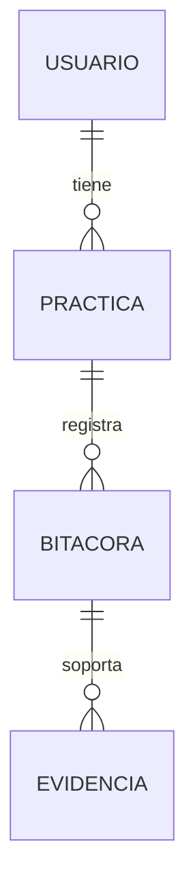

# Segunda Entrega - Proyecto Integrador

Universidad de Investigacion y Desarrollo (UDI)  
Programa: Licenciatura (Proyecto Integrador)  
Fecha: 31/03/2026  
Equipo: Rafael Fabian Carreno Barrera, Yeison Nicolas Marino Roberto, Santiago Andres Rojas  

---

## Tabla de contenido

1. Introduccion  
1.1 Proposito  
1.2 Alcance  
1.3 Definiciones  
1.4 Referencias  
1.5 Apreciacion global  
2. Descripcion del problema  
2.1 Perspectiva del producto  
2.2 Funciones del producto  
2.3 Usuarios  
2.4 Restricciones  
2.5 Suposiciones  
3. Objetivos  
4. Justificacion  
5. Plan del proyecto  
6. Requerimientos  
7. UML  
8. Base de datos  
9. Interfaz  
10. Referencias  
11. Anexos  

---

## 1. Introduccion

Las practicas academicas son un eje del proceso formativo...

## 1.1 Proposito
Definir, disenar y validar un prototipo funcional...

## 1.2 Alcance
- Autenticacion  
- Bitacora  
- Evidencias  
- Validacion  
- Reportes  

## 1.3 Definiciones
- Practica  
- Bitacora  
- Evidencia  

## 1.4 Referencias
- SWEBOK  
- ISO 25010  

## 1.5 Apreciacion global
Documento completo del proyecto.

---

## 2. Descripcion del problema

Fragmentacion de informacion...

---

## 3. Objetivos

Implementar prototipo funcional.

---

## 4. Justificacion

Centralizacion mejora trazabilidad.

---

## 5. Plan del proyecto

| Fase | Actividades | Entregables |
|------|------------|------------|
| Analisis | Requisitos | Documento |
| Diseno | UML | Diagramas |
| Construccion | Desarrollo | Prototipo |
| Pruebas | Validacion | Evidencias |

---

## 6. Requerimientos

### Funcionales
RF01 - Login  
RF02 - Usuarios  

### No funcionales
Seguridad, rendimiento, etc.

---

## 7. UML

Diagramas de casos de uso y dominio.

---

## 8. Base de datos

### Modelo ER

### Diccionario de datos

#### Usuario

| Campo | Tipo | Restriccion |
|------|-----|------------|
| id_usuario | NUMBER | PK |
| nombre | VARCHAR2 | NOT NULL |

#### Practica

| Campo | Tipo | Restriccion |
|------|-----|------------|
| id_practica | NUMBER | PK |
| estado | VARCHAR2 | - |

---

## 9. Interfaz

Login, dashboard, bitacora.

---

## 10. Referencias

Sommerville, Pressman.

---

## 11. Anexos

Diagramas, SQL, pruebas.
