# Manual de Usuario SIGPRA

Version: 2.0  
Fecha: 2026-05-16  
Ambiente: Desktop / Portable

## 1. Objetivo

Este manual explica el uso funcional de SIGPRA para:

- Estudiante
- Docente asesor
- Directora de programa

## 2. Requisitos

- Java instalado.
- Aplicacion ejecutandose desde NetBeans o desde portable.
- Oracle activo si se usa modo real.

## 3. Inicio de sesion

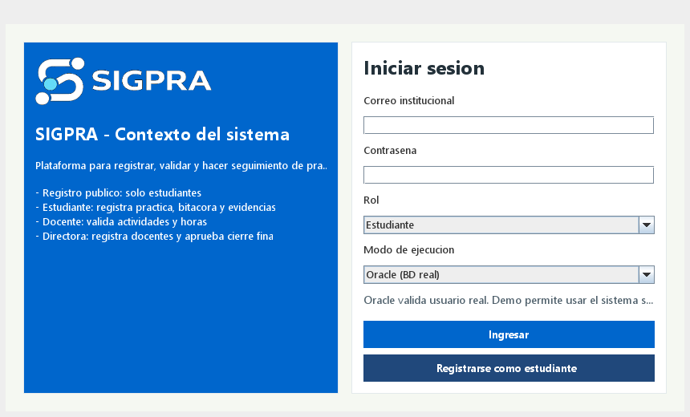

### Paso a paso

1. Abrir SIGPRA.
2. Ingresar `Correo institucional`.
3. Ingresar `Contrasena`.
4. Seleccionar `Rol`.
5. Seleccionar modo:
   - `Oracle (BD real)`
   - `Demo`
6. Pulsar `Iniciar sesion`.

### Resultado esperado

Se abre el dashboard correspondiente al rol seleccionado.

## 4. Flujo Estudiante

### 4.1 Autoregistro

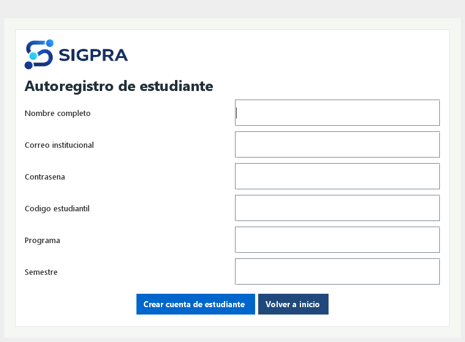

### Paso a paso

1. En login, pulsar `Registrarse como estudiante`.
2. Completar:
   - Nombre completo
   - Correo
   - Contrasena
   - Codigo estudiantil
   - Programa
   - Semestre
3. Pulsar `Crear cuenta de estudiante`.

### Resultado esperado

Se confirma registro exitoso y se redirige a login.

### 4.2 Dashboard estudiante

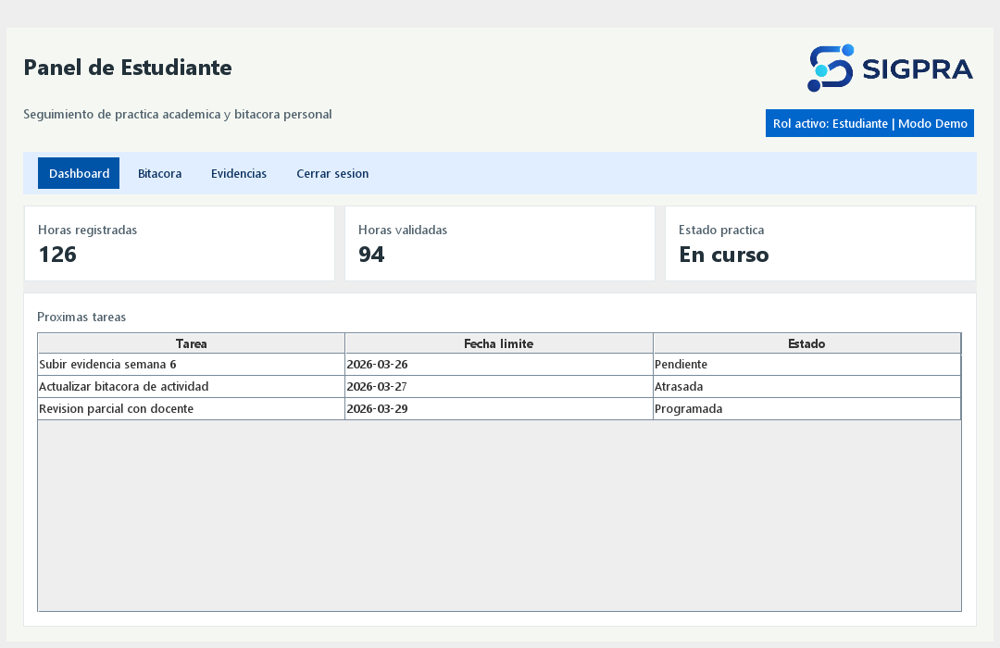

### Paso a paso

1. Iniciar sesion como estudiante.
2. Revisar indicadores:
   - Horas registradas
   - Horas validadas
   - Estado de practica

### Resultado esperado

El panel muestra el estado actual de la practica del estudiante.

### 4.3 Bitacora estudiante

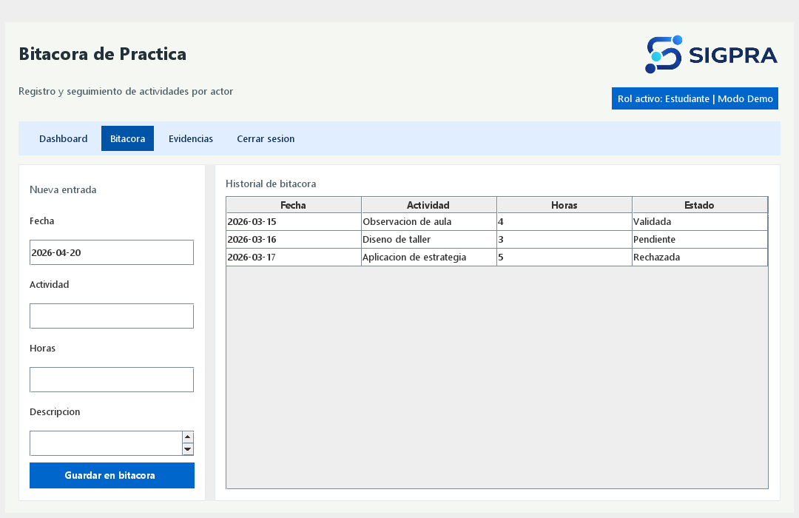

### Paso a paso

1. Ir a `Bitacora`.
2. Seleccionar fecha con `Calendario`.
3. Completar `Actividad`, `Horas`, `Descripcion`.
4. Pulsar `Guardar`.
5. Para editar una entrada pendiente: seleccionar fila y pulsar `Actualizar`.
6. Para eliminar una entrada pendiente: seleccionar fila y pulsar `Eliminar`.

### Reglas

- Solo se puede actualizar/eliminar si el estado es `Pendiente`.
- Horas permitidas: `0.1` a `12`.

### Resultado esperado

La entrada queda registrada y visible en el historial.

### 4.4 Evidencias

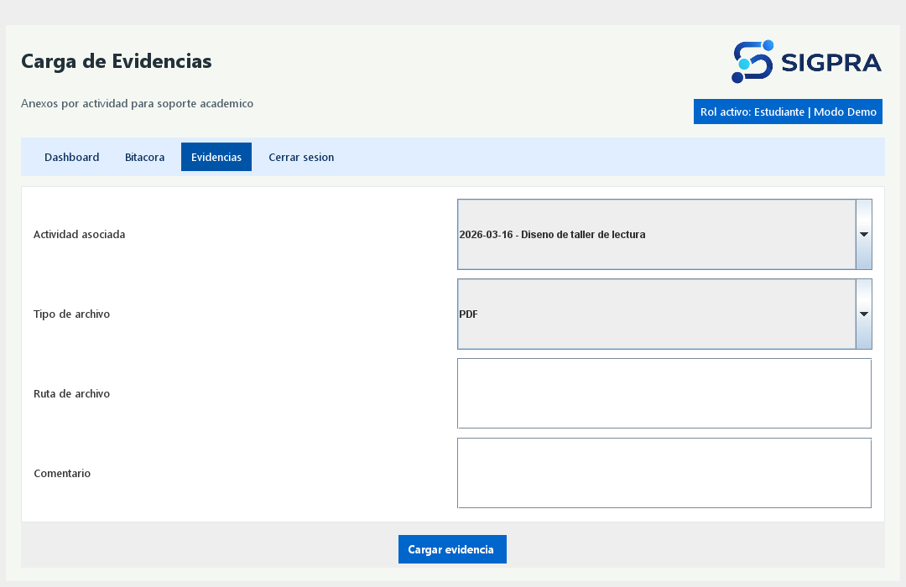

### Paso a paso

1. Ir a `Evidencias`.
2. Seleccionar actividad de bitacora.
3. Seleccionar tipo de archivo.
4. Registrar ruta y comentario.
5. Guardar evidencia.

### Resultado esperado

La evidencia queda asociada a la actividad seleccionada.

## 5. Flujo Docente asesor

### 5.1 Dashboard docente

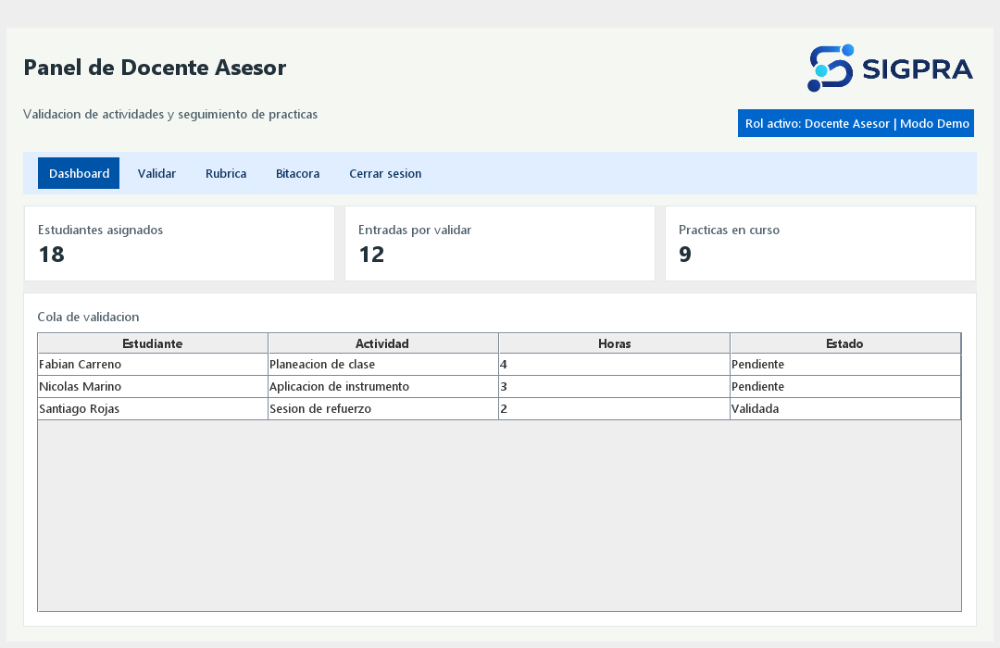

### Paso a paso

1. Iniciar sesion como docente.
2. Verificar:
   - Estudiantes asignados
   - Entradas pendientes
   - Practicas en curso

### Resultado esperado

Se visualiza la carga academica y pendientes de revision.

### 5.2 Validacion de bitacora

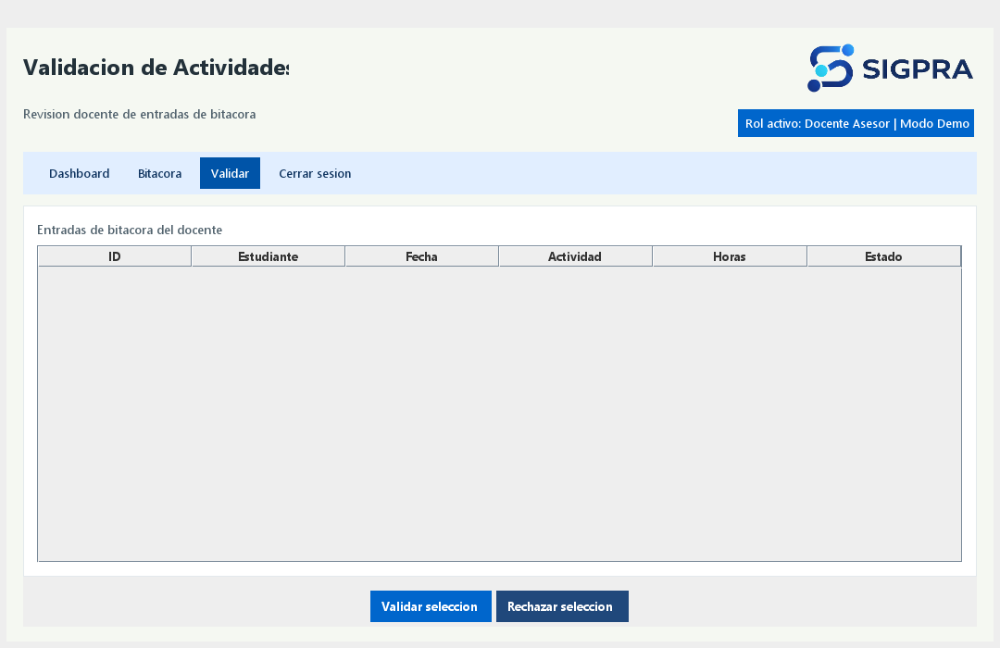
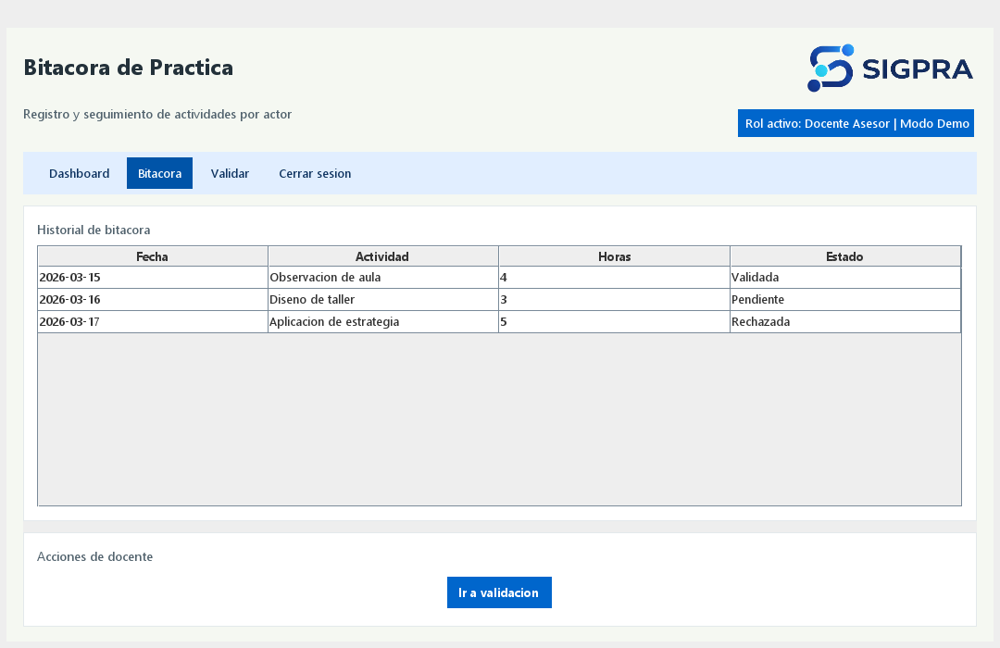

### Paso a paso

1. Abrir modulo `Validar`.
2. Seleccionar registro de estudiante.
3. Pulsar `Validar seleccion` o `Rechazar seleccion`.
4. Si rechaza, escribir observacion obligatoria.

### Resultado esperado

La entrada cambia de estado y queda trazabilidad en el sistema.

## 6. Flujo Directora de programa

### 6.1 Dashboard directoria

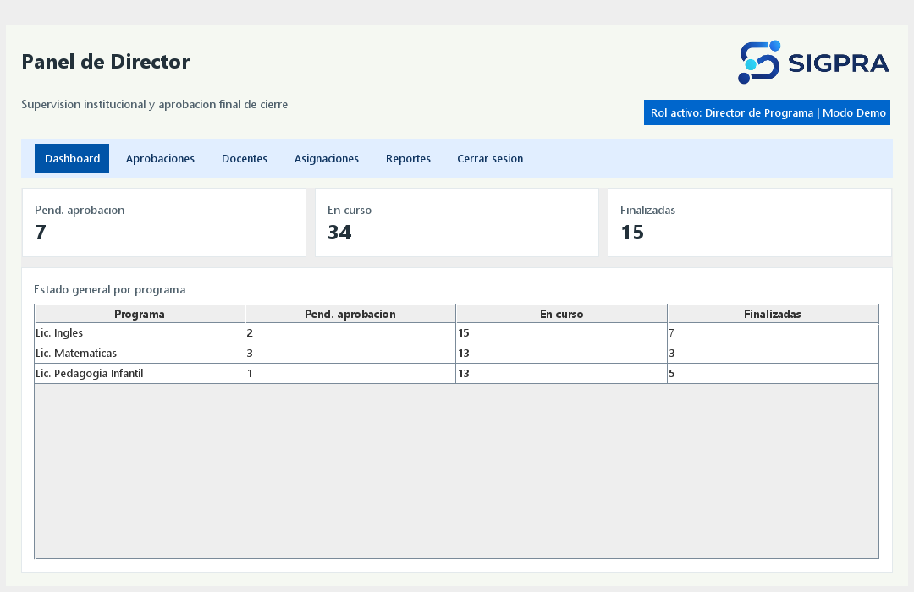

### Paso a paso

1. Iniciar sesion como directora.
2. Revisar KPIs:
   - Pendientes de aprobacion
   - En curso
   - Finalizadas

### Resultado esperado

Vista consolidada del estado institucional de practicas.

### 6.2 Asignaciones de practica

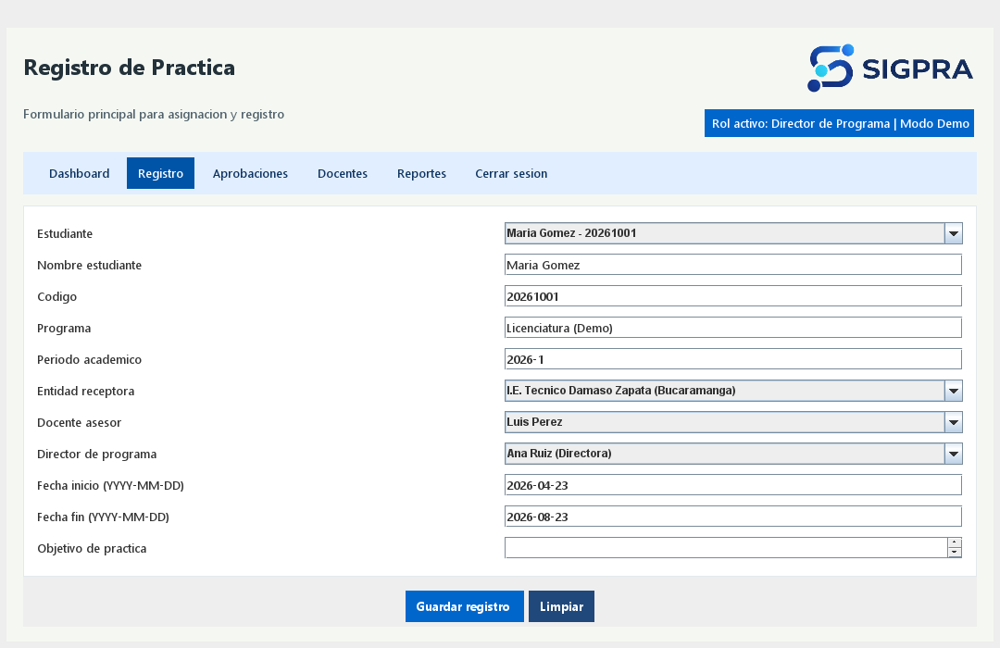

### Paso a paso

1. Ir a `Asignaciones`.
2. Seleccionar estudiante.
3. Seleccionar entidad, docente asesor y director.
4. Definir periodo y fechas.
5. Pulsar `Guardar registro`.
6. Si no aparece un estudiante nuevo, pulsar `Actualizar listas`.

### Resultado esperado

La practica queda creada en estado activo para seguimiento.

### 6.3 Aprobacion de cierre

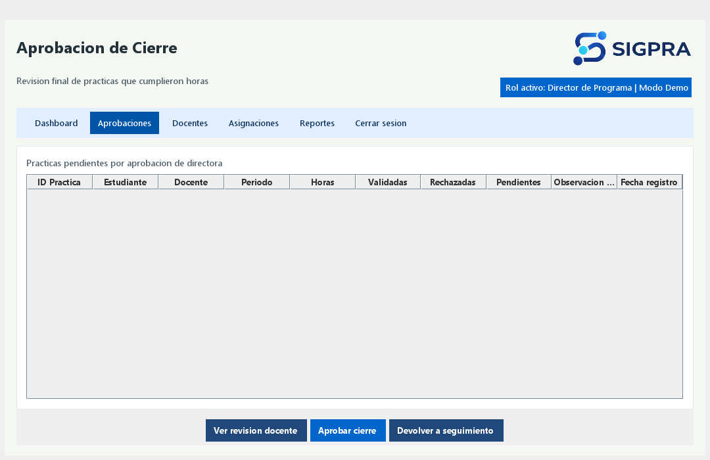

### Paso a paso

1. Ir a `Aprobaciones`.
2. Seleccionar practica pendiente.
3. Revisar informacion docente.
4. Elegir:
   - `Aprobar cierre`
   - `Devolver a seguimiento`

### Resultado esperado

La practica cambia de estado segun la decision tomada.

### 6.4 Registro docentes

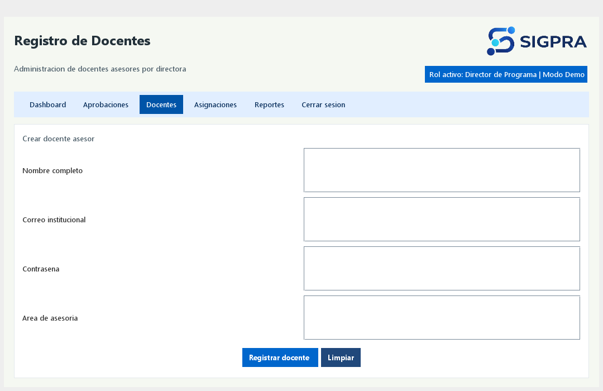

### Paso a paso

1. Ir a `Docentes`.
2. Ingresar datos del docente.
3. Guardar registro.

### Resultado esperado

Docente disponible para futuras asignaciones.

### 6.5 Reportes

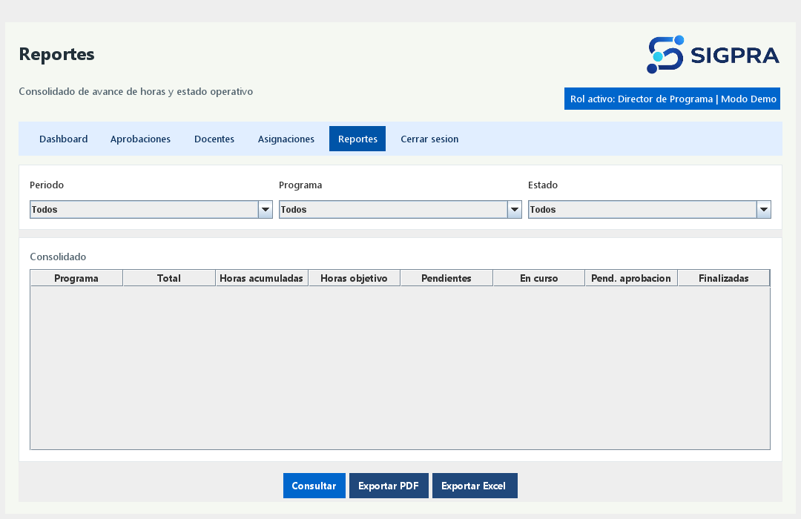

### Paso a paso

1. Ir a `Reportes`.
2. Filtrar por `Periodo`, `Programa`, `Estado`.
3. Pulsar `Consultar`.
4. Exportar:
   - `Generar informe (Vistas)` (TXT)
   - `Exportar PDF`

### Resultado esperado

Se obtiene consolidado por estudiante con horas y estado.

### Nota de logo en PDF

- El reporte PDF busca primero `src/branding/udi-logo.png`.
- Si no existe, busca `src/branding/udi-logo.jpeg`.
- Si no existe, usa logo de respaldo SIGPRA.

## 7. Errores frecuentes por pantalla

| Pantalla | Mensaje / Sintoma | Causa probable | Accion recomendada |
|---|---|---|---|
| Login | No inicia sesion | Credenciales o rol incorrecto | Verificar correo, clave y rol |
| Login Oracle | ORA-12514 / ORA-01017 | Conexion o credenciales BD | Revisar `db.properties`, servicio y usuario |
| Asignaciones | No aparece estudiante nuevo | Combos sin refrescar | Pulsar `Actualizar listas` |
| Bitacora | No se encontro practica activa | Estudiante sin asignacion activa | Crear asignacion primero |
| Reportes PDF | Logo no visible | Archivo logo faltante o incorrecto | Validar `udi-logo.png/jpeg` en `src/branding` |

## 8. Checklist rapido por rol

### Estudiante

- [ ] Puede registrarse.
- [ ] Puede iniciar sesion.
- [ ] Puede guardar bitacora.
- [ ] Puede cargar evidencia.

### Docente

- [ ] Puede iniciar sesion.
- [ ] Puede validar o rechazar entradas.
- [ ] Puede registrar observaciones.

### Directora

- [ ] Puede asignar practica.
- [ ] Puede aprobar o devolver cierre.
- [ ] Puede consultar y exportar reportes.

## 9. Buenas practicas

- Registrar actividades de bitacora de forma periodica.
- Adjuntar evidencia por cada actividad relevante.
- Validar pendientes de manera continua.
- Usar modo demo solo para pruebas funcionales.
