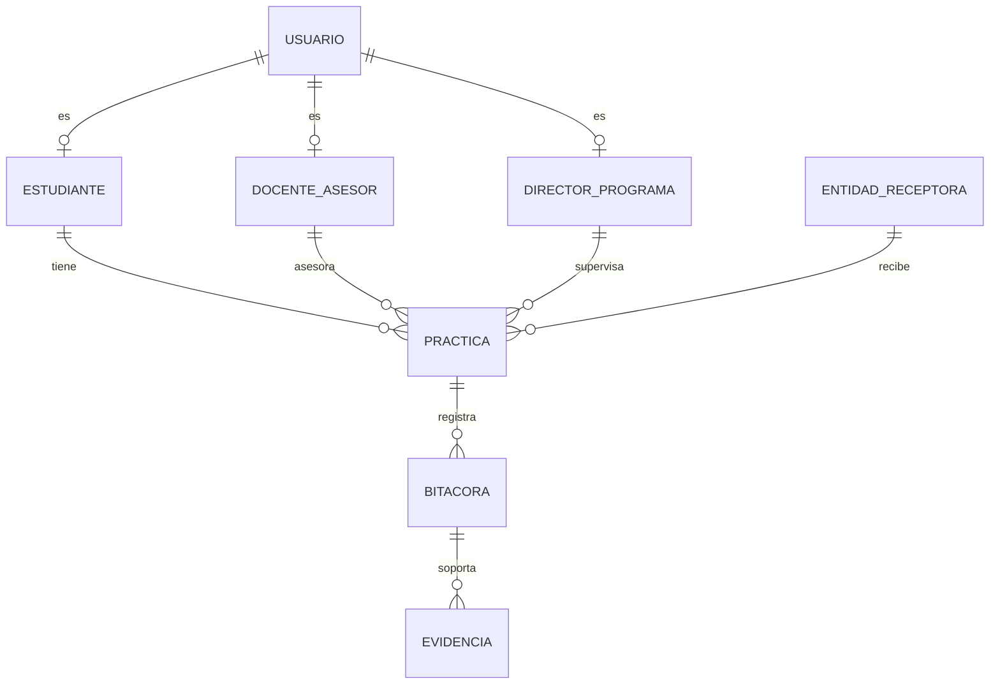

Segunda Entrega - Proyecto Integrador
Universidad de Investigacion y Desarrollo (UDI)
Programa: Licenciatura (Proyecto Integrador)
Fecha: 31/03/2026
Equipo: Rafael Fabian Carreno Barrera, Yeison Nicolas Marino Roberto, Santiago Andres Rojas
Tabla de contenido
Introduccion
1.1 Proposito
1.2 Alcance
1.3 Definiciones, acronimos y abreviaturas
1.4 Referencias
1.5 Apreciacion global
Descripcion del problema
2.1 Perspectiva del producto
2.2 Funciones del producto
2.3 Caracteristicas de los usuarios
2.4 Restricciones
2.5 Suposiciones y dependencias
Objetivos
3.1 Objetivo general
3.2 Objetivos especificos
Justificacion
Propuesta del plan del proyecto
Analisis de requerimientos del software
Diseno UML
Modelamiento de la base de datos
Diseno de interfaz
10. Referencias bibliograficas
11. Anexos
1. Introduccion
Las practicas academicas son un eje del proceso formativo porque conectan la teoria con contextos reales de trabajo. En el estado actual, la gestion se realiza con archivos sueltos, correos y hojas de calculo, lo que provoca duplicidad de datos, demoras en validacion de actividades y poca trazabilidad del avance del estudiante.
El proyecto integrador propone una solucion de software para centralizar el ciclo de practica (registro, bitacora, evidencias, validacion y reportes). La construccion del prototipo aplica competencias desarrolladas en cursos del plan de estudios, especialmente analisis de sistemas de informacion, bases de datos, programacion y pruebas.
Este documento presenta la segunda entrega mejorada: define el problema con mayor profundidad, formula objetivos verificables, detalla actividades del plan de trabajo, describe requisitos funcionales y no funcionales, y documenta los artefactos de UML, base de datos, interfaces y anexos de evidencia.
1.1 Proposito
Definir, disenar y validar un prototipo funcional de escritorio para la gestion de practicas academicas que soporte tres roles (estudiante, docente asesor y director de programa), con persistencia en Oracle y evidencia de pruebas funcionales.
1.2 Alcance
El alcance de esta entrega incluye:
Autenticacion por rol.
Registro de practicas academicas.
Registro y seguimiento de bitacora.
Carga de evidencias por actividad.
Validacion o rechazo de actividades por docente.
Cierre operativo de practica por cumplimiento de horas validadas.
Consulta de reportes por filtros de periodo/programa/estado.
Evidencia de pruebas funcionales sobre el prototipo.
Fuera de alcance para esta etapa:
Despliegue en produccion institucional.
Integraciones con sistemas externos institucionales (SSO, ERP, LMS).
Aplicacion movil nativa.
1.3 Definiciones, acronimos y abreviaturas
Practica academica: actividad formativa del estudiante en una entidad receptora.
Entidad receptora: institucion donde el estudiante ejecuta su practica.
Bitacora: registro periodico de actividades y horas reportadas.
Evidencia: archivo de soporte de una actividad de bitacora.
UML: Unified Modeling Language.
ER: Entidad-Relacion.
SRS: Software Requirements Specification.
RF: Requisito funcional.
RNF: Requisito no funcional.
1.4 Referencias
Reglamento institucional de practicas UDI.
Guia SWEBOK (IEEE Computer Society).
UML 2.5.1 (OMG).
ISO/IEC 25010 (calidad de software).
Documentos tecnicos del repositorio del proyecto.
1.5 Apreciacion global
El documento consolida los productos de la segunda entrega y articula lo solicitado por los docentes evaluadores: mayor profundidad del problema, claridad entre objetivos y requisitos, descripcion completa de actividades, y anexos verificables (diagramas, SQL, casos de uso, pruebas e interfaces).
2. Descripcion del problema
En la gestion actual de practicas academicas se observan cuatro causas principales:
Fragmentacion de la informacion entre correo, hojas de calculo y documentos no centralizados.
Ausencia de trazabilidad uniforme para validar actividades y horas.
Dificultad para consolidar reportes oportunos por programa y periodo.
Alta carga operativa para docentes y directivos en tareas de seguimiento manual.
Estas causas impactan a todos los actores:
Estudiante: no tiene una vista unica del estado de su practica.
Docente asesor: invierte tiempo en validaciones manuales repetitivas.
Director de programa: no cuenta con tableros consolidados para decisiones academicas.
Como resultado, se reduce la eficiencia del acompanamiento y aumenta el riesgo de errores administrativos o inconsistencias en el cierre del proceso.
2.1 Perspectiva del producto
El producto es un sistema de escritorio (Java Swing) con base de datos Oracle, orientado a apoyar la operacion academica del proceso de practicas. El acceso se controla por rol y cada actor visualiza funciones acordes con su responsabilidad.
2.2 Funciones del producto
Autenticacion y control de acceso por rol.
Registro de practicas (datos del estudiante, entidad, docente, periodo y objetivo).
Registro de actividades en bitacora y horas reportadas.
Carga de evidencias por actividad.
Validacion o rechazo de bitacora con observaciones.
Cierre operativo de practica segun horas validadas.
Consulta de estado e historial.
Reportes institucionales filtrables.
2.3 Caracteristicas de los usuarios
Estudiante: registra su practica, bitacora y evidencias; consulta avance.
Docente asesor: valida actividades y registra observaciones.
Director de programa: supervisa indicadores, gestiona entidades y consulta reportes.
2.4 Restricciones
Cumplimiento de lineamientos institucionales de datos y practicas.
Dependencia de conectividad y disponibilidad de Oracle local/institucional.
Restriccion de funciones segun rol autenticado.
Disponibilidad de los usuarios para validacion y seguimiento oportuno.
2.5 Suposiciones y dependencias
Existen lineamientos academicos definidos para practicas.
La institucion dispone de infraestructura minima para ejecutar el prototipo.
Los actores participan con datos reales o datos de prueba controlados.
3. Objetivos
3.1 Objetivo general
Implementar y validar un prototipo funcional de gestion de practicas academicas que permita autenticar usuarios por rol, registrar y validar actividades de bitacora y generar reportes por filtros, verificando su operacion con pruebas funcionales documentadas.
3.2 Objetivos especificos
Entregar la especificacion de requisitos y casos de uso detallados del sistema, diferenciando requisitos funcionales y no funcionales.
Entregar el diseno tecnico del sistema (UML, modelo de dominio, modelo ER y modelo relacional) coherente con el alcance de la entrega.
Construir un prototipo navegable en Java Swing con conexion Oracle que implemente los modulos principales por rol.
Ejecutar y documentar pruebas funcionales del prototipo con criterios de aceptacion y evidencias de resultado.
4. Justificacion
Centralizar la gestion de practicas en una sola plataforma mejora la trazabilidad del proceso, reduce errores por registro manual y permite seguimiento oportuno por parte de docentes y direccion de programa. La propuesta responde al problema identificado porque integra, en un mismo flujo, registro, validacion y reporte.
Adicionalmente, la solucion aporta valor academico al convertir los productos de los cursos del proyecto integrador en artefactos concretos y verificables: requisitos, diseno UML, esquema de base de datos, implementacion funcional y resultados de pruebas.
5. Propuesta del plan del proyecto
Se mantiene un enfoque en cascada, pero con actividades y entregables explicitos por fase.
| Fase | Actividades principales | Entregables de fase |
|---|---|---|
| 1. Levantamiento y analisis | Recoleccion de necesidades, identificacion de actores, definicion de alcance, elaboracion de casos de uso y RF/RNF. | Documento de requisitos, casos de uso detallados. |
| 2. Diseno | Arquitectura de la solucion, diagramas UML, modelo ER, modelo relacional, reglas de negocio y prototipos de interfaz. | Diagramas UML, esquema SQL, diseno de pantallas. |
| 3. Construccion | Implementacion de modulos por rol (login, practica, bitacora, evidencia, validacion, reportes), integracion con Oracle. | Prototipo funcional en Java Swing + scripts SQL. |
| 4. Pruebas y ajuste | Ejecucion de pruebas funcionales y negativas, correccion de errores, ajuste de validaciones y mensajes. | Checklist de pruebas con resultados y evidencia. |
| 5. Cierre academico | Consolidacion de documentacion tecnica y anexos, revision final de cumplimiento de objetivos de entrega. | Documento de segunda entrega y anexos completos. |
Nota de alcance: en esta etapa no se realiza despliegue productivo institucional; el cierre corresponde a validacion academica del prototipo en entorno de laboratorio.
Recursos tecnicos definidos:
Lenguaje: Java.
Framework UI: Java Swing.
IDE: NetBeans.
Base de datos: Oracle XE/Oracle compatible.
Control de versiones: GitHub.
Modelado UML: Astah + PlantUML.
6. Analisis de requerimientos del software
6.1 Requisitos funcionales (con descripcion)
| ID | Requisito | Descripcion funcional |
|---|---|---|
| RF01 | Iniciar y cerrar sesion | Permite autenticar al usuario con correo, clave y rol para habilitar el dashboard correspondiente. |
| RF02 | Gestionar usuarios y roles | Permite mantener usuarios activos con rol valido para operacion del sistema. |
| RF03 | Gestionar entidades receptoras | Permite registrar y actualizar entidades donde se desarrollan practicas. |
| RF04 | Registrar practicas academicas | Permite crear la practica con estudiante, periodo, entidad, docente, fechas y objetivo. |
| RF05 | Asignar docente y entidad | Permite vincular responsables academicos y entidad receptora a cada practica. |
| RF06 | Registrar actividades y horas | Permite al estudiante registrar entradas de bitacora con fecha, actividad, descripcion y horas. |
| RF07 | Cargar evidencias | Permite asociar archivos de soporte a cada actividad de bitacora. |
| RF08 | Validar o rechazar actividades | Permite al docente aprobar/rechazar entradas y registrar observaciones. |
| RF09 | Consultar estado e historial | Permite visualizar trazabilidad del proceso para cada rol. |
| RF10 | Generar reportes por filtros | Permite consultar consolidado por periodo, programa y estado operativo. |
6.2 Requisitos no funcionales (separados por calidad)
RNF01 Usabilidad: interfaz clara y consistente para los tres roles.
RNF02 Seguridad: control de acceso por rol, validacion de credenciales y restricciones por perfil.
RNF03 Rendimiento: respuestas menores a 3 segundos en consultas frecuentes de dashboard y reportes.
RNF04 Integridad de datos: uso de claves, foraneas y restricciones CHECK/UNIQUE en Oracle.
RNF05 Trazabilidad: cada validacion o rechazo debe conservar estado, observacion y responsable.
RNF06 Mantenibilidad: estructura modular por capas (UI, datos, modelo, configuracion).
RNF07 Disponibilidad academica: operacion estable en periodos de alta actividad.
6.3 Reglas de negocio relevantes
RN01: una actividad rechazada debe incluir observacion del docente.
RN02: horas reportadas por actividad en rango (0, 12].
RN03: fecha fin de practica no puede ser menor que fecha inicio.
RN04: cierre operativo de practica cuando horas_validadas >= horas_objetivo.
RN05: horas validadas de practica se recalculan con base en actividades VALIDADA.
7. Diseno UML
7.1 Diagrama de casos de uso
El diseno se distribuye en 4 diagramas para evitar saturacion:
D1 Autenticacion (comun a los 3 actores).
D2 Modulo Estudiante.
D3 Modulo Docente.
D4 Modulo Director.
Estos diagramas estan en formato editable y visual (PlantUML/Astah/PNG) y se referencian en anexos.
7.2 Diagrama de dominio (resumen)
Entidades de dominio consideradas:
Usuario
Estudiante
DocenteAsesor
DirectorPrograma
EntidadReceptora
Practica
Bitacora
Evidencia
Relaciones clave del dominio:
Estudiante 1..N Practica.
Practica 1..N Bitacora.
Bitacora 1..N Evidencia.
8. Modelamiento de la base de datos
8.1 Modelo entidad-relacion
El modelo ER implementa la trazabilidad completa del proceso de practica. A continuacion se presenta un resumen textual del ER:

8.2 Modelo relacional
Tablas principales implementadas:
usuario
estudiante
docente_asesor
director_programa
entidad_receptora
practica
bitacora
evidencia
Estructuras de soporte:
Indices para consultas frecuentes en practica y bitacora.
Vistas `vw_horas_practica` y `vw_reporte_programa` para indicadores y reportes.
8.3 Diccionario de datos (resumen)
`usuario.rol`: ESTUDIANTE, DOCENTE, DIRECTOR.
`usuario.estado`: ACTIVO, INACTIVO.
`practica.estado`: PENDIENTE, EN_CURSO, PENDIENTE_APROBACION, FINALIZADA.
`bitacora.estado_validacion`: PENDIENTE, VALIDADA, RECHAZADA.
9. Diseno de interfaz
9.1 Pantallas principales y comportamiento
| Pantalla | Actor | Comportamiento principal | Validaciones clave |
|---|---|---|---|
| Login | Todos | Autentica correo, clave y rol; redirige al dashboard correcto. | Credenciales validas y rol correcto. |
| Dashboard estudiante | Estudiante | Muestra estado de practica, horas reportadas/validadas y accesos a modulos. | Solo datos del estudiante autenticado. |
| Registro de practica | Estudiante/Director | Crea registro de practica con datos academicos y fechas. | Campos obligatorios y rango de fechas valido. |
| Bitacora | Estudiante | Registra entradas de actividad y actualiza historial. | Horas > 0 y <= 12; fecha valida. |
| Evidencias | Estudiante | Asocia archivos soporte a actividad de bitacora. | Ruta de archivo y tipo definidos. |
| Dashboard docente | Docente | Visualiza pendientes, practicas en curso y cola de validacion. | Solo practicas asignadas al docente. |
| Validacion de actividades | Docente | Aprueba/rechaza entradas y registra observacion. | Rechazo exige observacion. |
| Dashboard director | Director | Visualiza KPIs globales y consolidado institucional. | Acceso exclusivo por rol director. |
| Reportes | Director | Filtra por periodo/programa/estado y consulta consolidado. | Filtros coherentes con datos existentes. |
9.2 Criterios de presentacion
Navegacion por menu lateral con accesos por rol.
Mensajes de exito y error claros.
Tablas con recarga despues de cada operacion.
Coherencia visual entre formularios y reportes.
10. Referencias bibliograficas
SWEBOK V3.0 y portal IEEE Computer Society.
ISO/IEC/IEEE 12207.
ISO/IEC 25010.
UML 2.5.1 (OMG).
Sommerville, Software Engineering (10th ed.).
Pressman y Maxim, Software Engineering: A Practitioner's Approach (9th ed.).
Reglamento de practicas UDI.
11. Anexos
Anexos tecnicos incluidos en el repositorio del proyecto:
Anexo A. Casos de uso detallados: `gestion-practicas-desktop/CASOS_DE_USO_DETALLADOS.txt`
Anexo B. Checklist de pruebas funcionales: `gestion-practicas-desktop/CHECKLIST_PRUEBAS_FUNCIONALES.txt`
Anexo C. Diagramas de casos de uso (PNG):
`gestion-practicas-desktop/docs/astah_casos_uso/png/D1_Autenticacion.png`
`gestion-practicas-desktop/docs/astah_casos_uso/png/D2_Estudiante.png`
`gestion-practicas-desktop/docs/astah_casos_uso/png/D3_Docente.png`
`gestion-practicas-desktop/docs/astah_casos_uso/png/D4_Director.png`
Anexo D. Diagramas editables PlantUML:
`gestion-practicas-desktop/docs/astah_casos_uso/puml/D1_Autenticacion.puml`
`gestion-practicas-desktop/docs/astah_casos_uso/puml/D2_Estudiante.puml`
`gestion-practicas-desktop/docs/astah_casos_uso/puml/D3_Docente.puml`
`gestion-practicas-desktop/docs/astah_casos_uso/puml/D4_Director.puml`
Anexo E. Modelo de base de datos: `gestion-practicas-desktop/sql/01_schema_oracle.sql`
Anexo E2. Modelo reducido gestion de horas: `gestion-practicas-desktop/sql/01_schema_oracle_reducido_horas.sql`
Anexo F. Documentacion tecnica BD: `gestion-practicas-desktop/sql/DOCUMENTACION_BD.txt`
Anexo G. Capturas de interfaz: `gestion-practicas-desktop/docs/screenshots/*` (login, dashboards, registro, bitacora, evidencias, validacion, reportes)
---
Ajustes realizados frente a observaciones docentes
Introduccion ampliada y cerrada con presentacion del documento.
Problema profundizado con causas, impacto por actor y necesidad institucional.
Objetivo general reformulado con verbo verificable.
Objetivos especificos alineados a productos de cursos (requisitos, diseno, construccion, pruebas) y no redactados como RF.
Plan de trabajo detallado por fases, actividades y entregables; se ajusta "despliegue" a cierre academico.
Requisitos descritos uno a uno (no solo listado).
Requisitos de seguridad reforzados en RNF.
Se incluyen anexos concretos y rutas de evidencias para diagramas, SQL, pruebas e interfaces.
Diseno de interfaz ahora describe comportamiento de cada pantalla.
12. Ajuste propuesto de reduccion (enfoque gestion de horas)
Este ajuste simplifica el modelo de la Entrega 2 para operacion de registro, validacion y control de horas.
Cambios resaltados:
[SE_MANTIENE] login, registro de practica, bitacora, evidencias, validacion y reportes.
[MODIFICADO] registro publico: solo estudiante desde pantalla principal.
[MODIFICADO] registro de docentes: solo directora.
[MODIFICADO] cierre final de practica: aprobado por directora.
[ELIMINADO] modulo de rubrica.
[ELIMINADO] evaluacion detallada por criterio.
[MODIFICADO] reportes orientados a avance de horas y estado operativo de practica.
Cambios en base de datos:
[ELIMINADO] `rubrica`
[ELIMINADO] `criterio_rubrica`
[ELIMINADO] `evaluacion`
[ELIMINADO] `detalle_evaluacion`
[SE_MANTIENE] `usuario`, `estudiante`, `docente_asesor`, `director_programa`, `entidad_receptora`, `practica`, `bitacora`, `evidencia`
[MODIFICADO] estado de `practica` incorpora `PENDIENTE_APROBACION` para cierre por directora.
Documentos de soporte del ajuste:
`gestion-practicas-desktop/ENTREGA_2_AJUSTE_REDUCCION_HORAS.md`
`gestion-practicas-desktop/sql/01_schema_oracle_reducido_horas.sql`